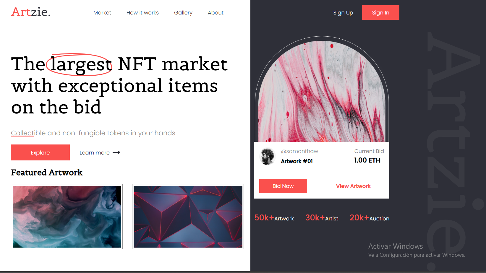

# CSS NFT Marketplace

This is a frontend project built with HTML, CSS (using Sass), and Vite.  
It features a **header** and **hero section** for a NFT Marketplace website.

## 🖥 Preview

## 🚀 Technologies Used

- HTML5
- CSS3 (Sass)
- Vite (as development build tool)

## 🚀 Setup Instructions

To run this project locally, follow these steps:
